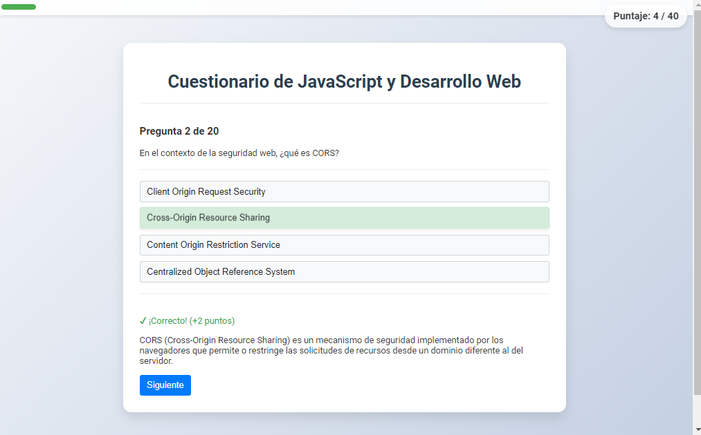
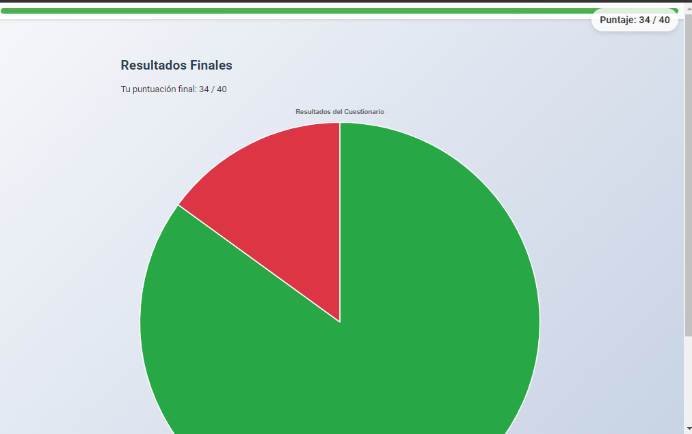

# Cuestionario Interactivo de JavaScript y Desarrollo Web


Este proyecto es un cuestionario interactivo diseñado para evaluar el conocimiento en JavaScript y desarrollo web. Utiliza tecnologías web modernas para proporcionar una experiencia de usuario atractiva y funcional.

## Características

- Preguntas aleatorias de una base de datos JSON
- Interfaz de usuario intuitiva y responsive
- Retroalimentación inmediata para cada respuesta
- Barra de progreso para seguimiento del avance
- Resultados finales con gráfico circular

Aquí tienes un ejemplo de cómo se ve una pregunta en el cuestionario:



## Cómo Usar

1. Clona este repositorio o descarga los archivos.
2. Abre `index.html` en tu navegador web.
3. ¡Comienza a responder las preguntas y pon a prueba tus conocimientos!

## Estructura del Proyecto

```
interquest/
├── index.html
├── api/
│   ├── questions1.json
│   ├── questions2.json
│   └── ...
├── img/
│   ├── banner.png
│   ├── ejemplo-pregunta.png
│   └── resultados.png
└── README.md
```

## Personalización

Puedes personalizar el cuestionario modificando los archivos JSON en la carpeta `api/`. Cada archivo contiene un conjunto diferente de preguntas.

## Resultados

Al finalizar el cuestionario, se muestra un resumen de los resultados, incluyendo un gráfico circular que representa las respuestas correctas e incorrectas.



## Contribuir

Las contribuciones son bienvenidas. Por favor, abre un issue para discutir cambios mayores antes de hacer un pull request.

## Licencia

[MIT](https://choosealicense.com/licenses/mit/)

---


